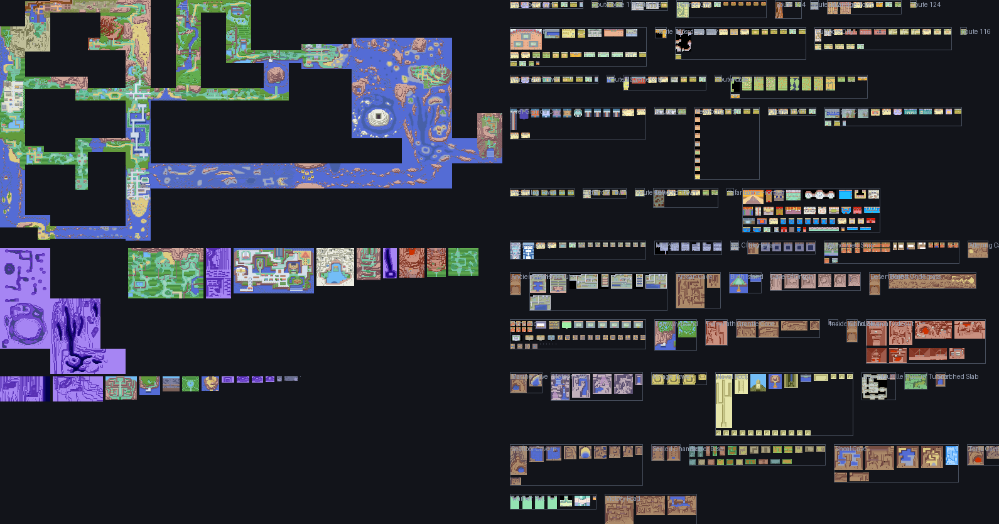

# Asistente de mapa para Pokémon Esmeralda "Warp Randomizer"

Va dibujando tu partida mientras juegas: lee del emulador dónde estás, revela
las zonas que pisas sobre un mapa de Hoenn montado con los gráficos reales del
juego, y une con una línea cada par de puertas que confirmas.



Los interiores no caben en la geografía de la región, así que se agrupan por
zona en un mosaico a la derecha, al estilo de los mapas interactivos de
Esmeralda.

**No destripa nada.** Los datos de la decompilación incluyen a dónde llevaba
cada puerta en el juego original, pero el asistente no los usa: solo aprovecha
*dónde está* cada puerta, que el randomizer no cambia. El destino se descubre
cruzándola.

## Documentación

- **[Manual de uso](docs/MANUAL.md)** — instalación, la pantalla explicada,
  qué hacer si algo falla.
- **[Cómo está hecho](docs/COMO_FUNCIONA.md)** — explicación técnica de cómo
  funciona por dentro y por qué está resuelto así.
- **[CLAUDE.md](CLAUDE.md)** — contexto para retomar el desarrollo.

Lo que sigue es la versión rápida.

## Qué necesitas

- Python 3.11 o superior
- [mGBA](https://mgba.io/) 0.10 o superior (el que trae scripting Lua)
- Un clon de [pret/pokeemerald](https://github.com/pret/pokeemerald), del que
  salen los gráficos y los datos de mapas. No hay que compilarlo.

## Puesta en marcha

```bash
python -m venv .venv
.venv\Scripts\activate            # en Linux/macOS: source .venv/bin/activate
pip install pillow numpy fastapi "uvicorn[standard]" pytest

git clone --depth 1 https://github.com/pret/pokeemerald.git ../pokeemerald
```

Genera los datos y las imágenes (una sola vez, tarda menos de un minuto):

```bash
python tools/build_data.py   --pokeemerald ../pokeemerald   # datos de mapas y puertas
python tools/render_maps.py  --pokeemerald ../pokeemerald   # 441 mapas a PNG + mipmaps
python tools/build_layout.py                                # ensambla el lienzo
```

Cada uno avisa si algo no cuadra. Al terminar tendrás 518 mapas, 1313 puertas
y unos 15 MB de imágenes en `assets/layouts/`.

## Jugar con el asistente

1. Arranca el servidor:

   ```bash
   uvicorn app.server:app
   ```

2. Abre <http://127.0.0.1:8000> en el navegador.

3. En mGBA, con la ROM ya cargada: **Tools → Scripting… → File → Load script**
   y elige `bridge/pker_bridge.lua`. En la consola del script debería aparecer
   `conectado a 127.0.0.1:8765`, y el panel del navegador pasar a
   *emulador conectado*.

Ya está. Camina, cruza una puerta y el mapa se irá abriendo solo.

- **Rueda** para acercar, **arrastrar** para mover, **clic** en un mapa para
  ver sus puertas.
- Las líneas **azules** son puertas probadas en un sentido; las **verdes**,
  pares confirmados de ida y vuelta.
- *Puertas sin probar* lista lo que te queda pendiente en cada sitio que ya
  conoces; al pulsar una entrada, la cámara va allí.
- *Exportar* descarga todo lo descubierto en JSON.

## Comprobación recomendada la primera vez

El asistente deduce por qué puerta has salido a partir de la casilla que
pisaste, dando por hecho que el parche solo cambia los **destinos** de las
puertas, no dónde están. Merece la pena confirmarlo al empezar: cruza tres o
cuatro puertas y comprueba que la puerta de origen que aparece en el panel es
la que realmente usaste. Si no cuadrase, avísalo: haría falta identificar la
puerta por el metatile pisado en lugar de por su posición.

## Si no detecta los mapas

El puente lee `gSaveBlock1Ptr` en `0x03005D8C`, que es donde está en Esmeralda
(USA). Si tu ROM parcheada lo ha movido, el panel no mostrará bien dónde estás.
Para encontrar la dirección buena, carga `bridge/pker_calibrate.lua` en mGBA,
cruza dos o tres puertas y sigue lo que escriba en la consola; después pon esa
dirección en `SAVEBLOCK1_PTR`, dentro de `bridge/pker_bridge.lua`.

## Probar sin emulador

`tools/simulate.py` se hace pasar por mGBA y reproduce un recorrido de ejemplo,
útil para ver el asistente funcionando antes de tocar la ROM:

```bash
uvicorn app.server:app          # en una terminal
python tools/simulate.py        # en otra
```

## Cómo está montado

```
tools/build_data.py     pokeemerald -> data/static/*.json
tools/render_maps.py    pokeemerald -> assets/layouts/*.png (+ mipmaps .4 y .16)
tools/build_layout.py   ensambla Hoenn por sus `connections` y empaqueta interiores
tools/preview_world.py  vuelca el lienzo entero a un PNG, para revisarlo
tools/simulate.py       finge ser el emulador

bridge/pker_bridge.lua     script que corre dentro de mGBA
bridge/pker_calibrate.lua  busca gSaveBlock1Ptr si hiciera falta

app/tracker.py   deduce qué puerta lleva a cuál
app/bridge.py    recibe las lecturas del Lua por TCP
app/state.py     progreso de la partida, en runs/<nombre>.json
app/server.py    API y WebSocket
app/static/      el lienzo (canvas, sin dependencias)
```

El tracker no toca sockets: se le pasan lecturas sueltas, así que su lógica se
prueba reproduciendo trazas grabadas.

```bash
pytest
```

Los tests cubren los casos que se las traen: puertas normales, escaleras, los
teletransportes del Gimnasio de Algaria (que dejan al jugador en el *mismo*
mapa), las conexiones entre rutas, los agujeros del suelo de la Torre Celeste
(que no figuran como puertas) y los huecos de muestreo, que no deben inventarse
puertas.

## Limitaciones conocidas

- Cargar un *savestate* puede registrar una transición rara, que aparecerá
  clasificada como `script`. No afecta a las puertas ya confirmadas.
- Vuelo, Teleportación y Cuerda Huida revelan el mapa de destino pero no crean
  ninguna conexión, que es lo correcto: no son puertas.
- Tres conexiones entre mapas del juego original no son simétricas (Pueblo
  Verdegal con la Ruta 116, y dos más), así que ahí los mapas se solapan por dos
  casillas. Es así en los datos de Nintendo, no un fallo del ensamblado.
- Los nombres de los mapas están en inglés. `data/i18n/es_overrides.json`
  permite traducir los que quieras: cada clave es un `MAP_*` o `MAPSEC_*`.
